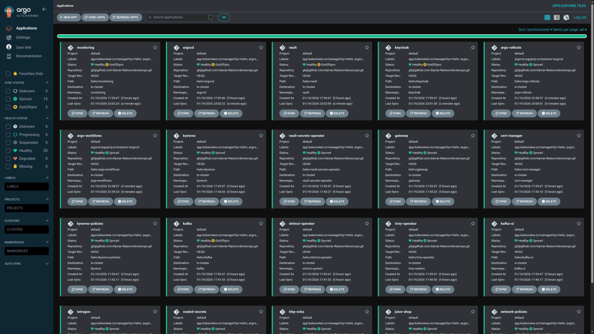
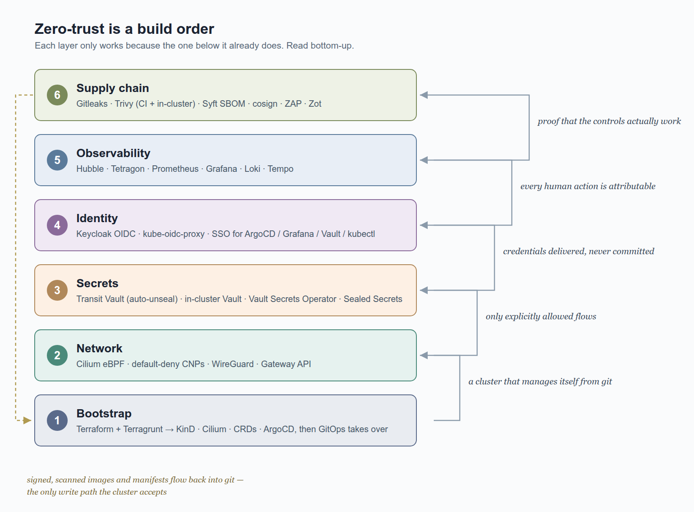
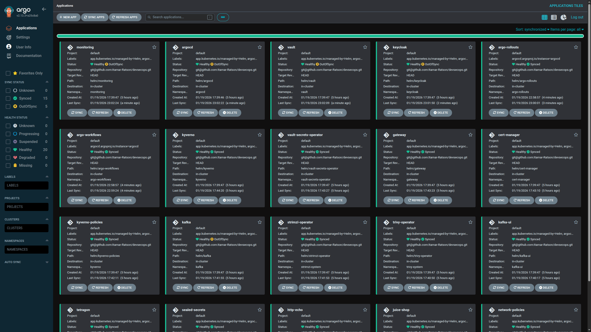
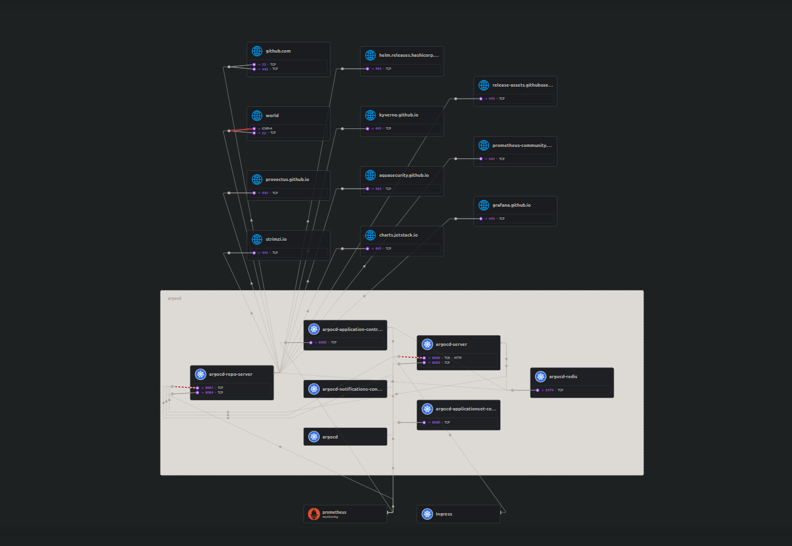
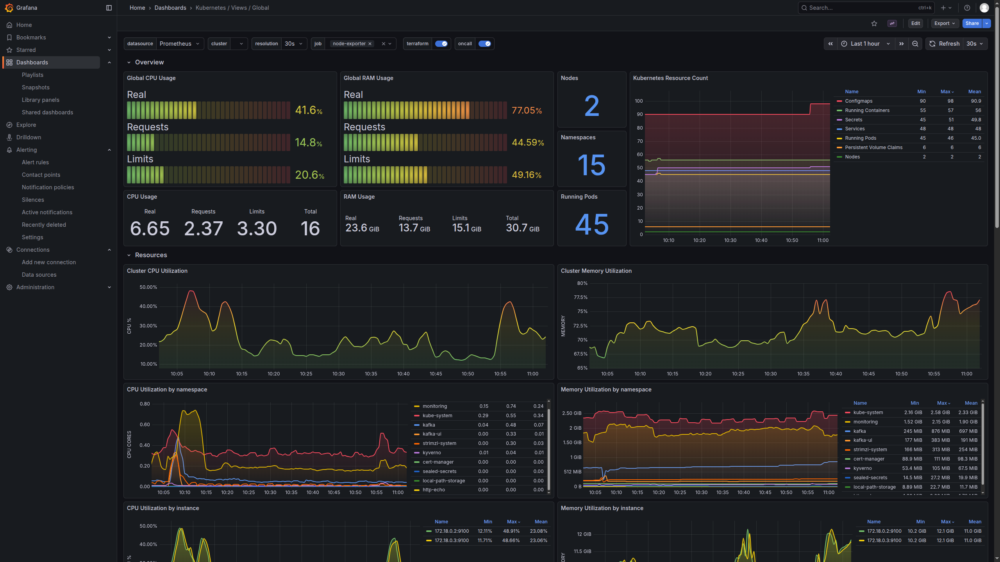
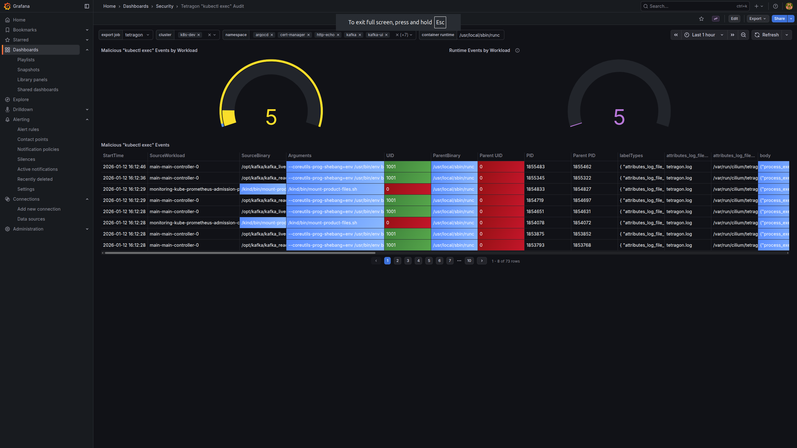
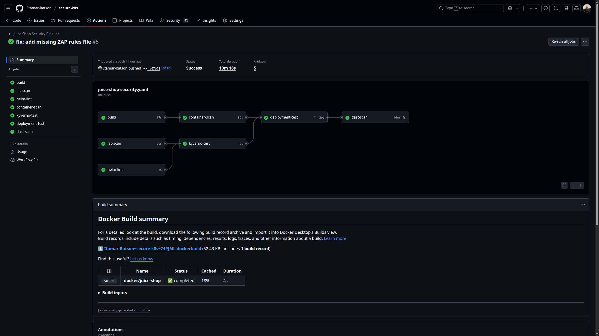
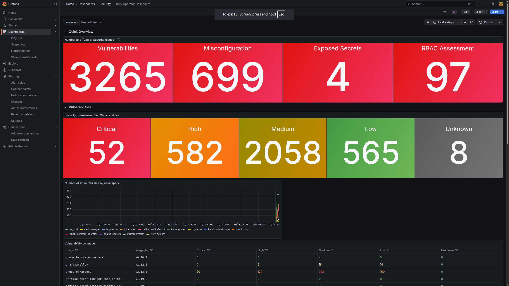
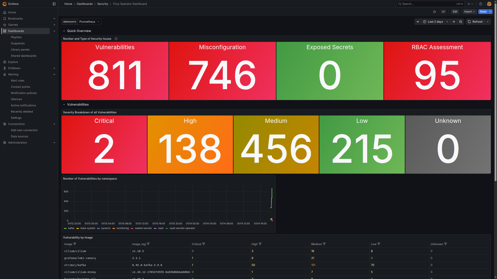

# Zero-Trust Is a Build Order, Not a Checklist

*Six layers of a DevSecOps stack that runs on a laptop — bootstrap, network, secrets, identity, observability, supply chain — and why the order is the point.*



Every zero-trust article ends the same way: with a checklist. Encrypt in transit. Deny by default. Rotate credentials. Verify identity everywhere. Scan your images. All true, all useless — because a checklist tells you *what* good looks like and nothing about *how the pieces hold each other up*. You can't check off "default-deny networking" before you understand every flow your secrets manager needs, and you can't understand those flows before the secrets manager exists.

I found this out by building the whole thing: a zero-trust Kubernetes platform — eBPF networking with default-deny policies, Vault with auto-unseal, OIDC single sign-on down to `kubectl`, runtime enforcement, a signed and scanned supply chain — that runs entirely on a laptop with [KinD](https://kind.sigs.k8s.io/). No cloud account required to follow along. Everything in this post links to a real file in the repo, pinned to a specific commit so the links stay accurate as the project moves: [github.com/Itamar-Ratson/devsecops](https://github.com/Itamar-Ratson/devsecops).

The thing the checklists never told me, and the thing I want to convince you of, is that **zero-trust is a build order**. Each layer is only trustworthy because the layer beneath it already is, and most of the interesting failures happen exactly at the seams between them. Here's the stack, bottom-up:



Let's walk it in order.

---

## 1. Bootstrap: imperative tooling's only job is to make itself unnecessary

The first question for any GitOps platform is a chicken-and-egg problem: ArgoCD deploys everything from git, but what deploys ArgoCD?

The answer here is a Terraform/Terragrunt bootstrap with a strict dependency chain: an HCP Terraform workspace per module, then a **transit Vault** (a small Vault instance in plain Docker, outside the cluster — remember it, it's the root of the secrets story), then the KinD cluster, then a minimal cluster bootstrap (Cilium, CRDs, Sealed Secrets), then ArgoCD. Terragrunt wires the outputs of each stage into the next — the ArgoCD module literally can't plan until the [transit Vault and KinD modules](https://github.com/Itamar-Ratson/devsecops/blob/9e897a0613440ba27ba8c876a17cee082118d5e0/terraform/live/k8s/bootstrap/argocd/terragrunt.hcl) have produced a token and an endpoint.

The interesting move is the handoff. Terraform installs ArgoCD as a Helm release, then creates exactly one more thing — a root "app-of-apps" Application resource — and *stops*:

```hcl
resource "kubernetes_manifest" "argocd_root_application" {
  manifest = {
    apiVersion = "argoproj.io/v1alpha1"
    kind       = "Application"
    metadata = {
      name      = "argocd"
      namespace = "argocd"
    }
    spec = {
      source = {
        repoURL = var.git_repo_url
        path    = "helm/argo/apps"
      }
      syncPolicy = {
        automated = { prune = false, selfHeal = true }
      }
    }
  }
}
```

*Trimmed; full file: [terraform/modules/k8s/bootstrap/argocd/main.tf](https://github.com/Itamar-Ratson/devsecops/blob/9e897a0613440ba27ba8c876a17cee082118d5e0/terraform/modules/k8s/bootstrap/argocd/main.tf)*

That one resource points ArgoCD at [helm/argo/apps](https://github.com/Itamar-Ratson/devsecops/tree/9e897a0613440ba27ba8c876a17cee082118d5e0/helm/argo/apps/templates), a Helm chart whose templates are twenty-five more Application resources — one per component, each annotated with a sync wave. Wave 1 is network policy and Cilium. Waves 2–3 are the security operators. Waves 4–7 are certificates, secrets, identity. Waves 8–9 are observability and, last of all, the actual applications. The build order from the diagram above isn't a metaphor: it's [an annotation](https://github.com/Itamar-Ratson/devsecops/blob/9e897a0613440ba27ba8c876a17cee082118d5e0/helm/argo/apps/templates/vault.yaml) on every component.



From this moment on, nobody — including me — runs `helm install` or `kubectl patch` against this cluster. Changing the platform means editing a values file and pushing a commit. The security consequence is easy to miss: **git becomes the only write path**, which means every change is reviewed, attributed, and revertable, and cluster credentials stop being something humans carry around.

It also forces a discipline that felt extreme until it didn't: when the cluster gets into a broken state, the remedy is `terragrunt run --all destroy` and a rebuild, never hand-patching live state. If a rebuild from git doesn't reproduce your platform exactly, your git repo is lying to you — and finding that out during an experiment on a laptop is a lot cheaper than finding out during an incident.

---

## 2. Network: default-deny is a forcing function, not a setting

The network layer is [Cilium](https://cilium.io/) — an eBPF CNI that replaces kube-proxy, encrypts pod-to-pod traffic with [WireGuard](https://github.com/Itamar-Ratson/devsecops/blob/9e897a0613440ba27ba8c876a17cee082118d5e0/helm/networking/cilium/values.yaml), and, crucially, enforces L3–L7 network policy per pod.

Here's the subtlety that makes the whole zero-trust posture work, and it's counterintuitive: **there is no "default-deny" policy anywhere in the repo.** In Cilium, the moment any policy selects a pod, that pod flips into allowlist mode — everything not explicitly permitted is dropped. So the cluster-wide "lockdown" is actually two cluster-wide *allow* policies, and the first one is DNS:

```yaml
apiVersion: cilium.io/v2
kind: CiliumClusterwideNetworkPolicy
metadata:
  name: allow-dns
spec:
  endpointSelector: {}        # selects every pod → default-deny for every pod
  egress:
    - toEndpoints:
        - matchLabels:
            k8s:io.kubernetes.pod.namespace: kube-system
            k8s:k8s-app: kube-dns
      toPorts:
        - ports:
            - port: "53"
              protocol: ANY
          rules:
            dns:
              - matchPattern: "*"   # L7: Cilium's proxy now sees every DNS query
```

*Full file, including the apiserver and cluster-egress policies: [clusterwide-policies.yaml](https://github.com/Itamar-Ratson/devsecops/blob/9e897a0613440ba27ba8c876a17cee082118d5e0/helm/networking/policies/templates/clusterwide-policies.yaml)*

By selecting every pod (`endpointSelector: {}`) and allowing only DNS, this policy simultaneously grants name resolution and revokes everything else. From there, every service must declare its own traffic — and I mean *declare*, because each component's Helm chart carries its own CiliumNetworkPolicy covering both directions. Here's a slice of [Vault's](https://github.com/Itamar-Ratson/devsecops/blob/9e897a0613440ba27ba8c876a17cee082118d5e0/helm/secrets/vault/server/templates/networkpolicy/vault.yaml):

```yaml
ingress:
  - fromEndpoints:
      - matchLabels:
          k8s:io.kubernetes.pod.namespace: secrets   # Vault Secrets Operator
    toPorts:
      - ports: [{ port: "8200", protocol: TCP }]
egress:
  - toEntities: [kube-apiserver]     # Kubernetes auth method
  - toCIDR: [172.16.0.0/12]          # the transit Vault, outside the cluster
    toPorts:
      - ports: [{ port: "8200", protocol: TCP }]
```

Writing these policies is where the forcing function bites. You cannot write an egress rule for a service whose traffic you don't understand — so you end up learning, flow by flow, what your platform actually talks to: which operator calls which webhook, who scrapes whom, which init container phones home. Hubble, Cilium's flow observability layer, is the debugging companion; this is the argocd namespace as Cilium sees it, every edge either allowed by a policy or dropped:



That discipline earned me the best war story in the repo. Cilium supports FQDN-based egress rules (`toFQDNs: [matchName: github.com]`) — much nicer than CIDR ranges. Mine silently blocked *everything*. The mechanism took a while to unravel: FQDN rules work by having Cilium's per-pod DNS proxy observe lookups and populate an IP-to-name cache, but my `allow-cluster-egress` policy — the one that permits pod-to-pod traffic so the Gateway can reach backends — was allowing DNS traffic straight to CoreDNS at L3/L4, *before* the L7 proxy ever saw it. No interception, empty FQDN cache, every FQDN rule matches nothing, all traffic dropped. Two individually-correct policies, one broken interaction at the seam. The fix (`toEntities: world` plus port restrictions instead of FQDN rules) matters less than the lesson: **network policies compose in non-obvious ways, and only flow-level observability (layer 5!) makes the composition debuggable.**

---

## 3. Secrets: the unseal problem, or turtles almost all the way down

Secrets management has its own chicken-and-egg problem, and most tutorials quietly skip it. Vault encrypts its storage and starts *sealed* — it can't decrypt its own data until someone provides unseal keys. On a laptop cluster that gets destroyed and rebuilt constantly, "someone types unseal keys" is a non-starter. But if you automate unsealing with a key stored… where, exactly? Turtles all the way down.

The repo's answer is the **transit Vault** from layer 1: a tiny Vault instance running in plain Docker *outside* the cluster, deployed by Terraform before the cluster exists. The in-cluster Vault delegates unsealing to it — that's the entire purpose of its existence:

```hcl
seal "transit" {
  address    = "http://<transit-vault>:8200"
  key_name   = "autounseal"
  mount_path = "transit/"
}
```

*In context — this config is passed through the ArgoCD Application itself: [helm/argo/apps/templates/vault.yaml](https://github.com/Itamar-Ratson/devsecops/blob/9e897a0613440ba27ba8c876a17cee082118d5e0/helm/argo/apps/templates/vault.yaml)*

The trust chain has to terminate somewhere; the trick is choosing where deliberately. Here it terminates in one Docker volume on the host — everything above it (the in-cluster Vault, and everything *it* protects) rebuilds from git, which is exactly the property a destroy-and-rebuild workflow needs.

Getting secrets *out* of Vault and into workloads is the [Vault Secrets Operator](https://developer.hashicorp.com/vault/docs/platform/k8s/vso) (VSO): custom resources that sync a Vault path into a native Kubernetes Secret and keep it fresh. Grafana's admin credentials, for example, are [a VaultStaticSecret](https://github.com/Itamar-Ratson/devsecops/blob/9e897a0613440ba27ba8c876a17cee082118d5e0/helm/observability/monitoring/templates/vault-secrets.yaml) — `path: monitoring/grafana`, `refreshAfter: 1h`, done. No secret material in git, no `kubectl create secret` in a runbook. (A second, smaller system — [Sealed Secrets](https://github.com/Itamar-Ratson/devsecops/tree/9e897a0613440ba27ba8c876a17cee082118d5e0/helm/secrets/sealed-secrets) — covers the handful of bootstrap-time secrets that must exist in git before Vault is up. Two tools, one rule: git never holds plaintext.)

The seam-failure this layer taught me lives in the VSO's authentication. A [VaultAuth resource](https://github.com/Itamar-Ratson/devsecops/blob/9e897a0613440ba27ba8c876a17cee082118d5e0/helm/secrets/vault/secrets-operator/templates/transit-vault-auth.yaml) tells the operator which ServiceAccount to authenticate with:

```yaml
apiVersion: secrets.hashicorp.com/v1beta1
kind: VaultAuth
metadata:
  name: transit-vault-auth
  namespace: secrets
spec:
  method: kubernetes
  kubernetes:
    role: vso
    serviceAccount: default    # ← resolved where you'd least expect
  allowedNamespaces: ["*"]
```

I read `serviceAccount: default` as "the default ServiceAccount in *this* namespace, where the VaultAuth lives." Wrong: VSO resolves it in the namespace of each *VaultStaticSecret referencing it* — so a secret in `monitoring` authenticates as `monitoring/default`, a secret in `argocd` as `argocd/default`, and Vault must trust each one. It costs you an afternoon precisely because both interpretations produce valid-looking YAML, and only one produces tokens. Mitigation, once understood: bind the Vault role per-namespace and set `automountServiceAccountToken: false` on workloads, so the `default` ServiceAccounts VSO borrows aren't also mounted into every pod.

---

## 4. Identity: one login, all the way down to kubectl

Secrets cover how *software* authenticates. Humans are worse. A platform like this has four admin UIs — ArgoCD, Grafana, Vault, a Kubernetes dashboard — and the default failure mode is four sets of static credentials in a password manager, shared over Slack when someone's locked out.

The identity layer replaces all of it with [Keycloak](https://www.keycloak.org/) as a single OIDC provider. And in keeping with layer 1's rule, the entire identity configuration — realm, groups, clients, redirect URIs — is [a JSON file in git](https://github.com/Itamar-Ratson/devsecops/blob/9e897a0613440ba27ba8c876a17cee082118d5e0/helm/identity/keycloak/templates/realm-config.yaml), imported at startup. Three groups (`admins`, `developers`, `viewers`) and one client per service; secrets templated in from Vault, never committed.

Each service then maps OIDC groups to its own authorization model. ArgoCD's [is five lines](https://github.com/Itamar-Ratson/devsecops/blob/9e897a0613440ba27ba8c876a17cee082118d5e0/helm/argo/cd/values-argocd.yaml):

```yaml
rbac:
  policy.csv: |
    g, admins, role:admin
    g, developers, role:admin
    g, viewers, role:readonly
  policy.default: role:readonly
  scopes: "[groups]"
```

Grafana and Vault do the equivalent. So far, standard SSO. The part most platforms skip — and the reason identity gets its own layer — is the Kubernetes API itself. Managed clusters give you OIDC integration as a checkbox; KinD doesn't, and rather than fight the apiserver's flags, the repo deploys [kube-oidc-proxy](https://github.com/Itamar-Ratson/devsecops/blob/9e897a0613440ba27ba8c876a17cee082118d5e0/helm/identity/kube-oidc-proxy/templates/deployment.yaml): a small authenticating reverse proxy that sits in front of the API server, validates the caller's OIDC token against Keycloak, and impersonates the resulting user and groups to the real apiserver:

```yaml
args:
  - --oidc-issuer-url=https://keycloak.../realms/devsecops
  - --oidc-client-id=headlamp
  - --oidc-username-claim=preferred_username
  - --oidc-groups-claim=groups
```

Point `kubectl` (or a dashboard) at the proxy instead of the apiserver, and cluster access rides the same Keycloak login as everything else — same groups, same RBAC review, one place to revoke a person. No more copying admin kubeconfigs around.

Chains like this fail as a unit, which is how this layer bit me. Symptom: log in to the Kubernetes dashboard via Keycloak — success — then an immediate "Lost connection to the cluster" and a bounce back to the login page. Nothing useful in the dashboard's own logs. The OIDC chain here is dashboard → kube-oidc-proxy → Keycloak, and the break was in the middle hop: kube-oidc-proxy validating tokens needs to fetch Keycloak's signing keys over HTTPS, and the CA bundle mounted into it — assembled by trust-manager from the cluster's private CA — didn't include *public* CAs, which Keycloak's certificate (via the gateway) chained to. `x509: certificate signed by unknown authority`, one hop deep, surfacing as a UI redirect two hops away. One line in the trust-manager Bundle (`useDefaultCAs: true`) fixed it. The transferable lesson: **when SSO breaks, walk the token's path hop by hop and read every component's logs** — the component showing the error is almost never the component having the problem.

---

## 5. Observability: you can't enforce what you can't see

By this point the cluster *refuses* a lot: unlisted flows, unsealed secrets, unauthenticated humans. Layer 5 answers a different question: how do you know any of it is actually working — and when it breaks, how do you see where?

The repo runs the standard Grafana stack — Prometheus for metrics, Loki for logs, Tempo for traces, Alloy shipping it all — and a cluster-overview dashboard earns its keep on a laptop, where the cluster competes with your browser for RAM:



But the two tools that belong to *this* post see what metrics can't. **Hubble** you met in layer 2 — it's how network policy failures stop being "connection timed out" and start being "here is the dropped flow, here is the policy that dropped it." The FQDN bug from earlier was undebuggable until Hubble showed DNS queries flowing merrily to CoreDNS *without* passing the L7 proxy.

**Tetragon** is the runtime counterpart: eBPF hooks on syscalls, so it observes what processes actually *do* — exec, file access, network calls — regardless of what the manifest claimed they'd do. And it can do more than watch. This policy, applied to the deliberately-vulnerable demo app in the cluster, kills any process that isn't the app's own binaries — not "alerts on," *kills*, with a SIGKILL fired from kernel space:

```yaml
apiVersion: cilium.io/v1alpha1
kind: TracingPolicy
metadata:
  name: juice-shop-enforcement
spec:
  podSelector:
    matchLabels:
      app: juice-shop
  tracepoints:
    - subsystem: "raw_syscalls"
      event: "sys_enter"
      selectors:
        - matchActions:
            - action: Sigkill
          matchBinaries:
            - operator: "NotIn"
              values: ["/usr/local/bin/node", "/usr/bin/node", "/bin/sh"]
```

*Full file: [juice-shop-enforcement.yaml](https://github.com/Itamar-Ratson/devsecops/blob/9e897a0613440ba27ba8c876a17cee082118d5e0/helm/security/tetragon/templates/policies/juice-shop-enforcement.yaml)*

Attacker gets RCE in the web app, tries to spawn `curl` or a reverse shell, and the process is dead before the exploit's second stage loads. The events land in Grafana, so the security dashboard doubles as an audit trail of everything that ran in sensitive namespaces:



One meta-lesson from operating all this, bought with a wasted evening: in a stack this interconnected, symptoms cascade. A single DNS misconfiguration once took out four services simultaneously, each with its own alarming-but-misleading error. The debugging rule that survived: **when several things fail at once, stop diagnosing components and go look at every affected component's logs for the shared cause.** Observability isn't dashboards; it's the ability to follow a failure across layer boundaries — which is why this layer had to exist before I could honestly trust layers 2 through 4.

---

## 6. Supply chain: scan twice, sign always

Everything so far protects the cluster at runtime. The last layer asks where the things *in* the cluster came from — and it starts before any code lands in a container. The CI pipeline runs the whole gauntlet on every push:



In order: [Gitleaks](https://github.com/Itamar-Ratson/devsecops/blob/9e897a0613440ba27ba8c876a17cee082118d5e0/.github/workflows/ci.yaml) scans not just the diff but the *entire git history* for leaked credentials on every push to main (secrets have a way of arriving in commit 3 and getting "deleted" in commit 4, where they live forever). Trivy scans the built image and fails the pipeline on critical or high CVEs. A second Trivy pass scans the Helm charts and Terraform as *config* — misconfigurations, not vulnerabilities. Then the pipeline deploys the whole platform onto a KinD cluster inside the GitHub runner and points OWASP ZAP at the running application — an actual [dynamic scan](https://github.com/Itamar-Ratson/devsecops/blob/9e897a0613440ba27ba8c876a17cee082118d5e0/.github/workflows/deployment-and-dast.yaml) against the same manifests that ship, on every merge. That's the payoff of a laptop-sized platform: **the entire production topology is cheap enough to create and destroy inside a CI job.**

What ships is also *provable*. Images are signed with [cosign](https://docs.sigstore.dev/) keylessly — no private key to leak; the signature is bound to the GitHub Actions workflow identity via Sigstore's OIDC flow (identity again, one layer up the stack) — and a Syft-generated SBOM is attested to the image alongside it:

```yaml
- name: Sign container image
  run: cosign sign --yes "$IMAGE@$DIGEST"

- name: Verify image signature
  run: |
    cosign verify \
      --certificate-oidc-issuer https://token.actions.githubusercontent.com \
      --certificate-identity-regexp ".../.github/workflows/ci.yaml@.*" \
      "$IMAGE@$DIGEST"

- name: Attest SBOM to image
  run: cosign attest --yes --predicate sbom.cdx.json --type cyclonedx "$IMAGE@$DIGEST"
```

*Full workflow: [.github/workflows/ci.yaml](https://github.com/Itamar-Ratson/devsecops/blob/9e897a0613440ba27ba8c876a17cee082118d5e0/.github/workflows/ci.yaml)*

Here's the part I'd argue most pipelines get wrong: they treat scanning as a *gate*, and a gate only fires when something passes through it. A CVE published on Tuesday doesn't care that your image passed its scan on Monday. So Trivy runs twice in this stack — once in CI against what's about to ship, and continuously in-cluster as [trivy-operator](https://github.com/Itamar-Ratson/devsecops/tree/9e897a0613440ba27ba8c876a17cee082118d5e0/helm/security/trivy-operator), which rescans every *running* workload and exports the findings to Prometheus, where they land on a Grafana dashboard next to the Tetragon events from layer 5.

That dashboard is also how the stack turns vulnerability management from anxiety into a work queue. Two days apart, same cluster:





From 3,265 findings (52 critical) to 811 (2 critical) — not through heroics, just image bumps and base-image swaps, worked through in priority order *because the list was visible and ranked*. And notice the loop closing: every one of those fixes was a commit, which CI scanned, signed, and attested, which ArgoCD deployed, which trivy-operator then re-measured. The supply chain layer doesn't end at the cluster boundary — it feeds the top of the diagram back into the bottom.

---

## What to steal (and what to leave in the lab)

The honest close: this is a learning lab, and part of its design is *being destroyable*. But the patterns split cleanly into what transfers to a production cluster as-is and what's laptop-scaffolding.

**Steal these:**

- **The bootstrap handoff.** IaC deploys the GitOps engine plus one root application, then never touches the cluster again. Sync waves encode your dependency order in git instead of in a runbook.
- **Implicit default-deny via a cluster-wide DNS-only allow policy**, then per-service CiliumNetworkPolicies living in each service's own chart — ingress *and* egress. The forcing function is the point.
- **Scan twice.** CI Trivy gates what ships; trivy-operator watches what runs. The second one is an afternoon to deploy and it's the one that catches Tuesday's CVE.
- **Keyless cosign signing bound to CI identity**, with SBOM attestation. No key management, and verification pins provenance to a specific workflow file.
- **OIDC everywhere, including kubectl.** On managed clusters you won't need kube-oidc-proxy — EKS/GKE/AKS have OIDC hooks — but "cluster access rides the same SSO and groups as every dashboard" should be non-negotiable anywhere.
- **The debugging rules**, which cost nothing: walk broken auth chains hop by hop, and when multiple services fail at once, hunt the shared cause before diagnosing any single component.

**Leave in the lab:** KinD itself (obviously); the transit Vault as a Docker container on the same host it protects — in production that root of trust belongs in a cloud KMS or an HSM, though *transit auto-unseal as a pattern* transfers directly; file-backed single-node Vault storage; and Keycloak's demo realm with test users defined in JSON.

One caveat earned the hard way: composed policies fail in ways their parts don't. The FQDN-egress story — two correct policies, one broken interaction — is the strongest argument in this post for building the observability layer *before* you think you need it.

If the build-order framing stuck, the last step follows from it: this isn't a stack you can evaluate by reading about it, because the seams — where all the real lessons live — only show up when it runs. It runs on a laptop. [Clone it](https://github.com/Itamar-Ratson/devsecops), `terragrunt run --all apply`, and go break a network policy while Hubble is watching.

---

*The repo behind every link in this post: [github.com/Itamar-Ratson/devsecops](https://github.com/Itamar-Ratson/devsecops) — KinD, Cilium, Vault, Keycloak, Tetragon, ArgoCD, and the CI to hold it together. All file links pinned to commit `9e897a0`.*
